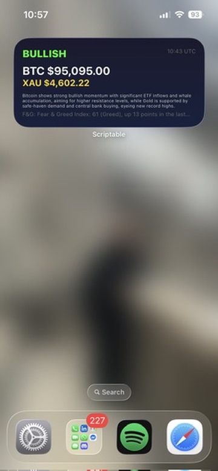
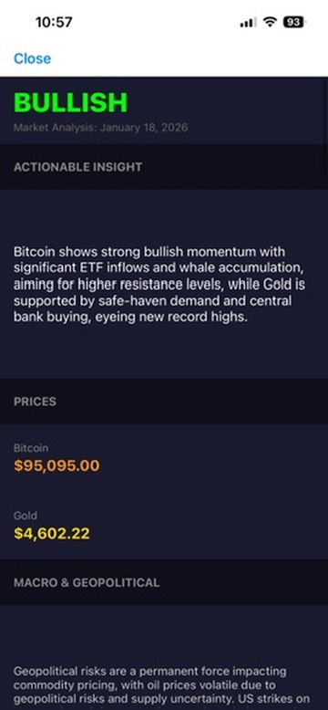

# BOLD Widget

Free iPhone widget that shows live BTC and Gold prices with market analysis. Runs on GitHub Actions, uses Gemini AI for analysis, stores data in a Gist, displays via Scriptable.

Made this for when I wake up in the morning and want to know the state of the market before any day trading.

## How it works

1. GitHub Action runs hourly (6am-10pm UTC)
2. Python script fetches prices (CoinGecko) and news (DuckDuckGo)
3. Gemini analyses the data and outputs a market report
4. Report saved to a public Gist
5. Scriptable widget reads the Gist and displays it

## Stack

- **Scheduler:** GitHub Actions
- **AI:** Gemini 2.5 Flash-Lite
- **Prices:** CoinGecko API
- **Search:** ddgs (DuckDuckGo)
- **Storage:** GitHub Gist
- **Display:** Scriptable (iOS)

## Files

- `main.py` - fetches data and calls Gemini
- `BOLD_widget.js` - Scriptable widget code
- `.github/workflows/daily_update.yml` - runs hourly

## Docs

- [Overview](docs/OVERVIEW.md)
- [Limits](docs/LIMITS.md)
